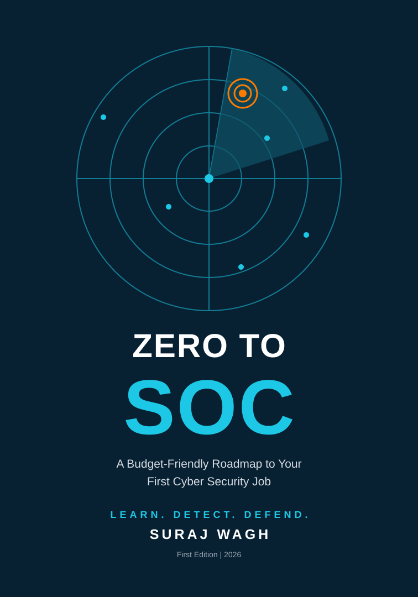

# ZERO TO SOC

<p align="center">
  
</p>

<p align="center">
  <strong>A Budget-Friendly Roadmap to Your First Cyber Security Job</strong><br>
  <em>LEARN. DETECT. DEFEND.</em>
</p>

<p align="center">
  <a href="./Zero_to_SOC_Book.pdf"></a>
  
  <a href="./LICENSE"></a>
  <a href="./SHARING.md"></a>
</p>

---

## 📖 About the Book

**ZERO TO SOC** is a practical, beginner-friendly roadmap for starting a career in cyber security, with a focus on the **SOC Analyst** role.

The book is designed for beginners, career changers, help-desk/support professionals, and working IT professionals who want to build practical security skills.

It emphasizes learning the fundamentals, practicing in hands-on environments, documenting your work, and preparing for your first cyber security job.

## 📥 Read the Book

**[Open / Download the complete PDF](./Zero_to_SOC_Book.pdf)**

---

## 📚 Table of Contents

### Getting Started
- A Message from the Author
- About the Author
- Preface
- How to Use This Book
- Getting Started

### Part I — Cyber Security Foundations
- **Chapter 1:** Introduction to Cyber Security
- **Chapter 2:** What Is a Security Operations Center?

### Part II — Technical Foundations
- **Chapter 3:** Networking Essentials
- **Chapter 4:** Operating Systems: Linux and Windows
- **Chapter 5:** Security Fundamentals

### Part III — Core SOC Skills
- **Chapter 6:** Logs and SIEM
- **Chapter 7:** Alert Triage and Incident Response
- **Chapter 8:** Phishing Analysis
- **Chapter 9:** Threat Intelligence, MITRE ATT&CK and the Kill Chain
- **Chapter 10:** Network Analysis with Wireshark

### Part IV — Hands-On Practice
- **Chapter 11:** Building Your Home Lab
- **Chapter 12:** Practice Platforms and CTFs
- **Chapter 13:** Writing Investigation Reports

### Part V — Your Career
- **Chapter 14:** The 16-Week Study Plan
- **Chapter 15:** Certifications
- **Chapter 16:** Resume, LinkedIn and Interviews
- **Chapter 17:** Job Hunt and Your First 90 Days
- **Chapter 18:** Career Paths and Professional Ethics

### Appendices & Reference
- **Appendix A:** Cheat Sheets
- **Appendix B:** Resource Directory
- **Appendix C:** Checklists
- References and Citations
- Quiz Answer Key
- Glossary
- Index
- A Message to Readers

---

## 🎯 Who Is This For?

This book is especially useful for:

- Beginners starting cyber security
- Career changers
- Help-desk and IT support professionals
- Working IT professionals moving toward security
- Learners interested in SOC Analyst roles

---

## 🗺️ Suggested Learning Paths

### 🟢 Starting from Zero
Begin with the early chapters and build your foundation step by step.

### 🔵 IT / Networking Background
If you already understand IT and networking fundamentals, skim the introductory material and focus more on SOC concepts and practical investigation.

### 🟠 SOC Theory Already Covered
Move toward the practical lab and investigation sections to turn theory into hands-on experience.

### 🟣 Preparing for Jobs
Use the sections covering certifications, resume/LinkedIn preparation, interviews, job hunting, and the first 90 days.

---

## 💻 Practical Learning

The book encourages hands-on learning through:

- Home labs
- CTF practice
- Log analysis
- SIEM-related exercises
- Phishing analysis
- Network investigation
- Investigation reporting

The goal is not only to learn concepts, but to **practice, document, and demonstrate what you can do**.

---

## 👤 About the Author

**Suraj Wagh** is an IT professional in India who writes about starting a cyber security career, especially SOC analysis.

---

## 📚 Book Information

| Item | Details |
|---|---|
| Title | **ZERO TO SOC** |
| Subtitle | A Budget-Friendly Roadmap to Your First Cyber Security Job |
| Tagline | **LEARN. DETECT. DEFEND.** |
| Author | **Suraj Wagh** |
| Edition | First Edition |
| Year | 2026 |

---

## 📜 License & Sharing

This repository uses a **custom book-sharing license**, not a standard open-source software license.

You may freely share the **complete and unmodified book** with credit to Suraj Wagh.

You may not:

- Sell or rent the book
- Modify or rebrand it
- Present it as your own work
- Include it in a paid course or paid training package without permission
- Republish substantial portions without permission

See **[LICENSE](./LICENSE)** for the complete terms and **[SHARING.md](./SHARING.md)** for a reader-friendly summary.

### Security and lab safety

Hands-on security activities in the book are intended for systems you own, isolated labs, or platforms where you have explicit permission to test. Follow applicable laws and platform rules.

---

## ⭐ Support the Project

If you find **ZERO TO SOC** useful:

- ⭐ Star this repository
- 📖 Share the book with someone beginning a cyber security career
- 💼 Use the practical exercises to build your skills and portfolio
- 🔗 Share the repository rather than redistributing modified copies

---

## 📂 Repository

```
zero-to-soc/
├── README.md
├── COVER.svg
├── Zero_to_SOC_Book.pdf
├── LICENSE
└── SHARING.md
```

---

<p align="center">
  <strong>ZERO TO SOC — LEARN. DETECT. DEFEND.</strong>
</p>
